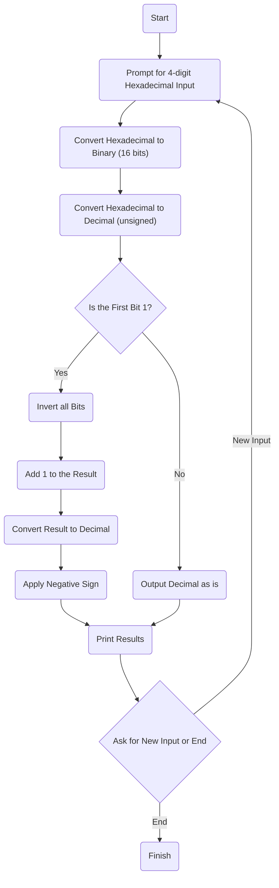

# Extra_update

This repository contains the program `extra_update.c`, which converts a hexadecimal number to binary and decimal representations, including two's complement representation for a 16-bit processor.

## What is a Hexadecimal Number?

A hexadecimal number is a number expressed in the base-16 numeral system. This system uses 16 symbols: the numbers 0 to 9 and the letters A to F, where A=10, B=11, C=12, D=13, E=14, and F=15. For example, `A200` and `3F7C` are valid hexadecimal numbers.

## Program Description

The `dop_project.c` program performs the following tasks:

1. Converts a hexadecimal number to its binary representation.
2. Converts a hexadecimal number to its decimal representation (unsigned).
3. Converts a binary number to its decimal representation, considering the two's complement.

The program prompts the user to enter a 4-digit hexadecimal number, and then performs the conversions.

## Algorithm Diagram

The following diagram illustrates how the program works:

## Algorithm Diagram

Algorithm Diagram
The following diagram illustrates how the program works:


## Compilation and Execution

To compile and run the program, follow these steps:

1. Clone the repository:
    ```bash
    git clone https://github.com/Chinilshik-kalkulatorov/Task_update.git
    cd Task_update
    ```

2. Compile the program using the `gcc` compiler:
    ```bash
    gcc dop_project.c -o dop_project.c
    ```

3. Run the compiled program:
    ```bash
    ./dop_project.c
    ```

4. When prompted, enter a 4-digit hexadecimal number (e.g., A1B2).

## Example Output

After running, the program will display the conversion results for the entered hexadecimal number. For example:

```plaintext
Enter a 4-digit hexadecimal number: A1B2
Hexadecimal: A1B2
Binary (16 bits): 1010000110110010
Decimal (unsigned): 41394
Decimal (two's complement): -24142
```
```plaintext

Enter a 4-digit hexadecimal number: 3F7C
Hexadecimal: 3F7C
Binary (16 bits): 0011111101111100
Decimal (unsigned): 16252
Decimal (two's complement): 16252
